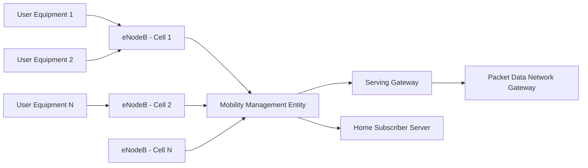
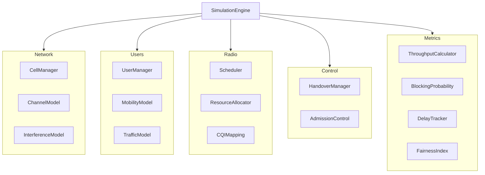
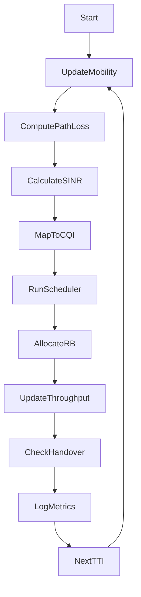
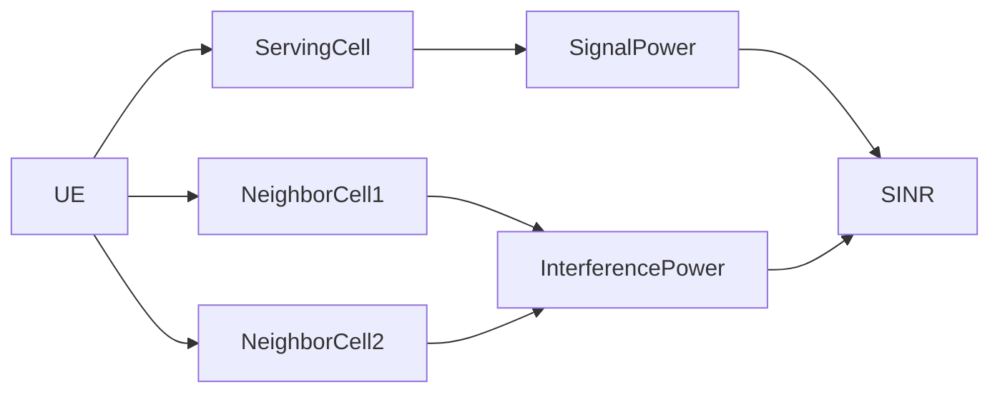
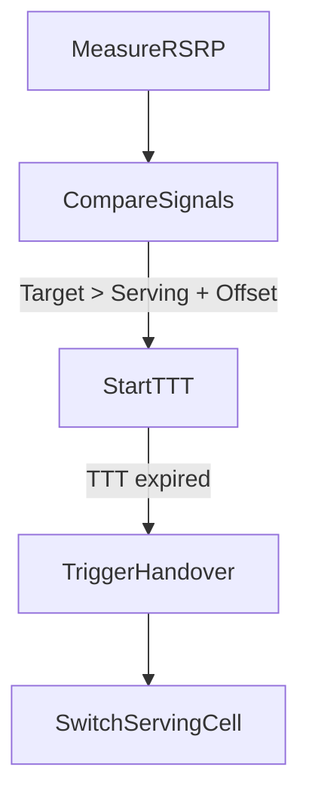
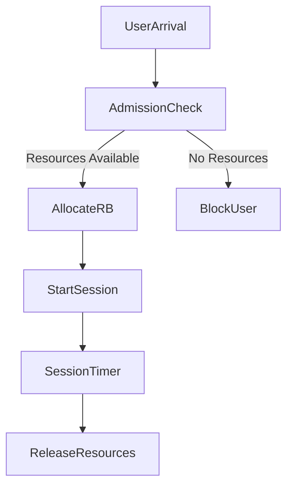
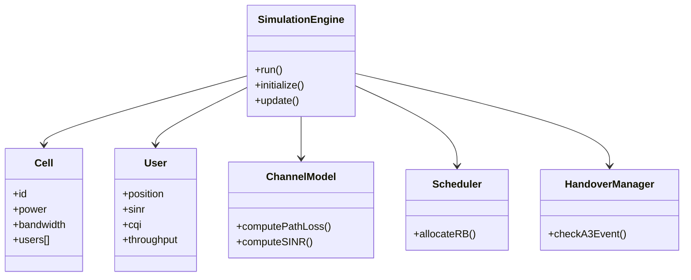

# LTESim
LTESim

It models:

* LTE logical architecture (inspired by 3rd Generation Partnership Project standards)
* Simulator internal software architecture
* Multi-cell + traffic + handover + scheduler integration

---

# LTE System-Level Simulator Architecture (Markdown + Mermaid)

---

# 1. High-Level LTE Logical Architecture



Note for Simulator:

You will NOT simulate full EPC signaling in detail.
You will abstract:

* Authentication → simple approval model
* IP allocation → dummy assignment
* Core delay → fixed latency model

Because this is **system-level simulation**, not packet-level.

---

# 2. Simulator Software Architecture (Core Design)

Now we move from telecom architecture to software architecture.



---

# 3. Main Simulation Time Loop

This is the heart of the simulator.



TTI = 1 ms (Transmission Time Interval)

---

# 4. Multi-Cell Interference Model



Formula implemented in ChannelModel:

```
SINR = Signal / (Interference + Noise)
```

---

# 5. Handover Decision Flow (Event A3 Model)



This is simplified LTE Event A3 logic.

---

# 6. Traffic Flow Model (Erlang-Based)



Blocking Probability calculated via:

* Erlang B formula
* Real-time simulation result comparison

---

# 7. Object-Oriented Class Relationship (For Python / MATLAB)



---

# 8. Mapping to Real LTE Components

| Real LTE | Simulator Equivalent  |
| -------- | --------------------- |
| eNodeB   | Cell class            |
| UE       | User class            |
| PHY      | ChannelModel          |
| MAC      | Scheduler             |
| RRC      | HandoverManager       |
| EPC      | Abstracted core logic |

This abstraction follows 3GPP conceptual layering but keeps simulation efficient.

---

#  Final Simulator Structure (Directory Example)

```
lte_simulator/
│
├── main.py
├── config.py
│
├── network/
│   ├── cell.py
│   ├── channel_model.py
│   ├── interference.py
│
├── users/
│   ├── user.py
│   ├── mobility.py
│   ├── traffic.py
│
├── radio/
│   ├── scheduler.py
│   ├── cqi_mapping.py
│
├── control/
│   ├── handover.py
│   ├── admission.py
│
├── metrics/
│   ├── throughput.py
│   ├── blocking.py
│   ├── fairness.py
│
└── results/
    ├── plots/
    ├── logs/
```

---

#  What This Architecture Achieves

The simulator will be able to:

* Support N cells
* Support M users
* Simulate mobility
* Simulate interference
* Model traffic statistically
* Compare scheduler algorithms
* Evaluate handover performance
* Produce research-grade graphs

---

